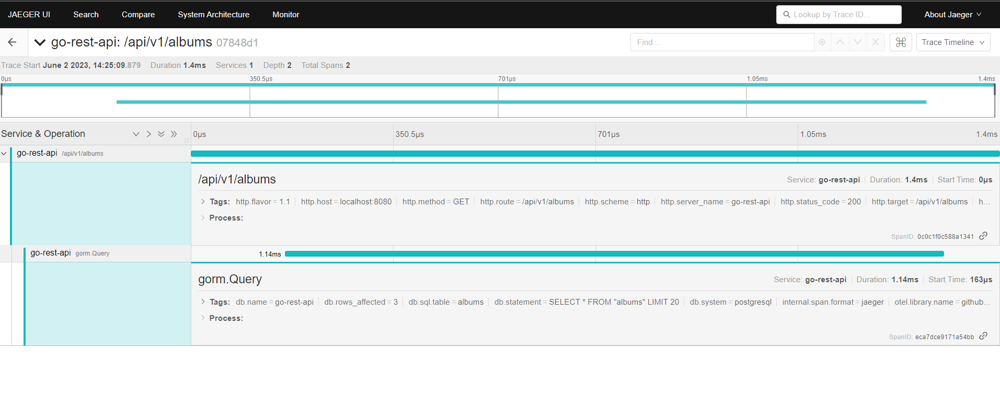

# GO Rest API

This repository implements a REST API using Go Lang. The main idea behind it is to implement this project using techniques that makes it production-releasable, so I tried to avoid as much as possible to simply get the first example available on the internet and just copy it. No. The idea is to implement in a way that it surely be used as a template for production services.

## Project Structure

The project is structured thinking about Hexagonal architecture approach. It means that it should be possible to add more than one input protocol and, independent from how the command reach the service, all the business logic will be the same and produce the same results. It means that even though the project starts as a REST API, using HTTP, it is possible to add new input protocols such as AMQP or even sockets and just reference the service implementation to get access to the same business logic. That is the meaning of the folder `ports`, that has the port(package) `http`, but can also contain ports such as `amqp`, `sockets` and so on.


about the other packages:
* `db`: contains the implementation to connect to a database using `GORM` 
* `models`: contains the interfaces/contracts of the API
* `services`: implements the business logic
* `swagger`: auto generated swagger documentation


## Features

### Request Validation

The validation of each request data happens on the controller located at `ports/<protocol>/controllers/<domain>/<operation>.go`.

### HTTP Request Logs

Each request will dispatch 2 log entries by default: one once the request arrives and the other before responding to the client.

### Testing

The repository contains tests files to test each component. Because of it, the implemented services will always contain a mock implementation so it will make things easier to implement tests.

### Swagger Documentation

Each controller contains special comments to generate the Swagger documentation. The documentation is available under the route `/swagger/index.html`

### Dependency Injection

All the instances are managed by a container DI that is built on the package `main`.

### Open Telemetry

In order to get telemetry data from the application, the repository implements open telemetry tracing. Each means that each request generates a Span Context with at least a `spanId` and a `traceId`. These data is logged in by the application logger, making it possible to identify the logs that are from the same request. 

for example, the request:

```sh
  curl http://localhost:8080/api/v1/albums
```

will generate the following logs:

```json
{"clientIP":"127.0.0.1","hostname":"groot","level":"debug","method":"GET","msg":"request received","path":"/api/v1/albums","spanId":"0c0c1f0c588a1341","time":"2023-06-02T14:25:09-03:00","traceId":"07848d18a57ac1595b5e0913c5189217","userAgent":"curl/7.81.0"}
{"level":"debug","msg":"get albums","resultLength":3,"spanId":"0c0c1f0c588a1341","time":"2023-06-02T14:25:09-03:00","traceId":"07848d18a57ac1595b5e0913c5189217"}
{"clientIP":"127.0.0.1","dataLength":159,"hostname":"groot","latency":2,"level":"info","method":"GET","msg":"response sent","path":"/api/v1/albums","referer":"","spanId":"0c0c1f0c588a1341","statusCode":200,"time":"2023-06-02T14:25:09-03:00","traceId":"07848d18a57ac1595b5e0913c5189217","userAgent":"curl/7.81.0"}
```

were all these logs contains the spanId `0c0c1f0c588a1341` and the traceId `07848d18a57ac1595b5e0913c5189217`, meaning that these logs were generate by the same operation.

But not just it, it is also possible to propagate this information to other services such as the database, making it possible to identify the queries that were executed by a specific request.

On this implementation, the tracer is using `Jaeger` to collect the information



In this case, the operaion has generated 2 spans (where each span represents the same operation into a different context/service) 1 for the request and 1 for the database.

we can see that the request happened on the route `/api/v1/albums`, for example, and the database has executed the statement `	SELECT * FROM "albums" LIMIT 20`.

## Requirements
* [GoLang 1.20](https://go.dev/dl/)

OR 

* [Docker](https://www.docker.com/products/docker-desktop/) 
* [Docker Compose](https://docs.docker.com/compose/install/)

## Configuring the project

All configurations are centralized on a `.env` file, so, the first step is to copy the `.env.example` file and paste is into a `.env.` file on the root of the project. You can also run:

```
cp .env.example .env
```

## Start the dependencies:

```
docker compose up
```

run the app 

```
make start
```
